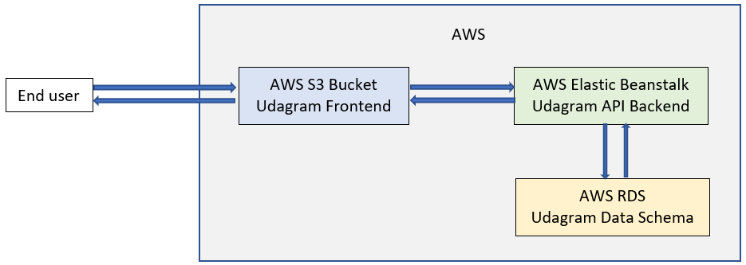

# Infrastructure

## AWS services used in the project

- **RDS**
  - RDS provides database storage for application schema through PostgreSQL.
- **S3 Bucket**
  - S3 bucket is used to host Udagram Frontend and uploaded images from backend API.
- **Elastic Beanstalk**
  - Elastic Beanstalk is used host Udagram Backend API.

## Infrastracture Schema

